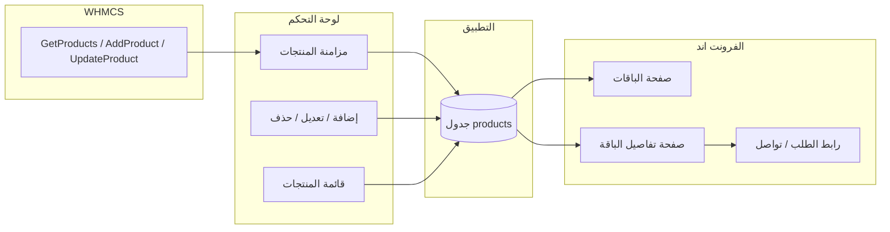

# خطة ربط باقات WHMCS مع لوحة التحكم والفرونت اند

## الوضع الحالي

- **النموذج:** [app/Models/Product.php](app/Models/Product.php) يحتوي على `whmcs_id`, `gid`, `name`, `description`, `pricing` (array), `status`, `hidden`, و accessors مثل `getPriceAttribute`, `getGroupNameAttribute`.
- **المزامنة:** [app/Services/WhmcsApiService.php](app/Services/WhmcsApiService.php) يوفر `getProducts()`, `syncProducts()`, `syncProduct(Product $product)`. لا يوجد `addProduct`, `updateProduct`, `deleteProduct` رغم استدعائها من [app/Http/Controllers/Admin/ProductController.php](app/Http/Controllers/Admin/ProductController.php).
- **لوحة التحكم:** قائمة منتجات، إضافة/تعديل/حذف، زر "مزامنة مع WHMCS" (POST إلى syncAll). عرض السعر في القائمة يعتمد على `pricing['monthly']` أو `pricing['msetupfee']`.
- **الفرونت اند:** [resources/views/frontend/pages/packages.blade.php](resources/views/frontend/pages/packages.blade.php) ثابت (3 بطاقات). [resources/views/frontend/pages/package-detail.blade.php](resources/views/frontend/pages/package-detail.blade.php) صفحة ثابتة واحدة. المسار الحالي: `frontend.packages` و `frontend.package-detail` بدون معامل.

---

## 1. إكمال WhmcsApiService (إضافة/تحديث/حذف منتج)

- تنفيذ **addProduct(array $data)** باستدعاء `AddProduct` من WHMCS API مع المعاملات المطلوبة (name, type, gid, description, paytype, pricing بحسب وثائق WHMCS)، وإرجاع `['success' => true, 'pid' => ...]` أو رسالة خطأ.
- تنفيذ **updateProduct($pid, array $data)** باستدعاء `UpdateProduct` مع معرف المنتج والمعاملات القابلة للتحديث.
- تنفيذ **deleteProduct($pid)** باستدعاء `DeleteProduct` (إن وُجد في واجهة WHMCS) أو الاعتماد على الحذف المحلي فقط إن لم يكن مدعوماً.
- التحقق من [config/whmcs_allowed_actions.php](config/whmcs_allowed_actions.php): إضافة `UpdateProduct` و `DeleteProduct` إن لم تكونا في القائمة.

---

## 2. إصلاح Product و ProductController

- **Product:** إضافة `sales_count` إلى `$fillable` إن كان العمود موجوداً في الجدول (من [database/migrations/2023_12_16_000012_add_sales_count_to_products_table.php](database/migrations/2023_12_16_000012_add_sales_count_to_products_table.php)).
- **ProductController::store:** عدم تمرير `json_encode($pricing)` بل مصفوفة `$pricing` لأن النموذج يلقي `pricing` إلى array. إزالة أو تعديل أي حقل غير موجود في النموذج (مثل sales_count إن لم يكن في fillable).
- **ProductController::update:** نفس الأمر لـ `pricing`. التأكد من أن استدعاء `updateProduct()` يمرر التنسيق الذي يتوقعه WHMCS.

---

## 3. لوحة التحكم – تحسينات اختيارية

- في صفحة عرض المنتج [admin/products/show](resources/views/admin/products/show.blade.php): إظهار تفاصيل التسعير (شهري، ربع سنوي، سنوي) وزر "عرض في الموقع" يوجه إلى `route('frontend.package-detail', $product->id)` إن كان المنتج غير مخفي ونشط.
- في قائمة المنتجات: توضيح أن "مزامنة مع WHMCS" تجلب الباقات من WHMCS وتحدّث الجدول المحلي؛ يمكن إظهار عمود "آخر مزامنة" (synced_at) إن رغبت.

---

## 4. الفرونت اند – صفحة الباقات (قائمة)

- إنشاء **Frontend PackageController** (أو إضافة دوال في controller موجود):
  - **index():** جلب المنتجات المعروضة في الموقع:  
  `Product::where('hidden', false)->where('status', 'Active')->orderBy('gid')->orderBy('name')->get()`  
  وتمريرها إلى العرض.
- تعديل المسار في [routes/frontend.php](routes/frontend.php): استبدال الإرجاع الثابت لـ `frontend.packages` باستدعاء الـ controller مع `$products`.
- تحديث [resources/views/frontend/pages/packages.blade.php](resources/views/frontend/pages/packages.blade.php):
  - عرض البطاقات من `$products`: الاسم، الوصف المختصر، السعر (من accessor أو أول دورة متاحة)، رابط إلى صفحة تفاصيل الباقة.
  - استخدام نفس أسلوب البطاقات الحالي (glass-panel, course-card) مع بيانات ديناميكية.
  - في حال عدم وجود منتجات: عرض رسالة مناسبة ورابط للرئيسية أو للتواصل.

---

## 5. الفرونت اند – صفحة تفاصيل الباقة

- مسار جديد مع معامل: مثلاً `GET /packages/{id}` أو `/package/{id}` باسم `frontend.package-detail` مع تمرير `id`.
- **show($id):** جلب المنتج بـ `Product::where('id', $id)->where('hidden', false)->where('status', 'Active')->firstOrFail()` (أو 404).
- تحديث [resources/views/frontend/pages/package-detail.blade.php](resources/views/frontend/pages/package-detail.blade.php):
  - عرض الاسم، الوصف، جدول تسعير (شهري، ربع سنوي، نصف سنوي، سنوي من `$product->pricing`).
  - زر "اطلب الآن" / "اشترك الآن":
    - إما رابط إلى صفحة الطلب في WHMCS، مثلاً من إعداد: `config('whmcs.order_url') . '?pid=' . $product->whmcs_id` (مع التحقق من وجود whmcs_id).
    - أو رابط إلى صفحة التواصل `route('frontend.contact')` مع تمرير اسم الباقة (استفسار).
- خبزة تنقل: الرئيسية / الباقات / اسم الباقة.

---

## 6. إعداد رابط الطلب من الفرونت اند

- في [config/whmcs.php](config/whmcs.php) إضافة مفتاح مثل `order_url` أو `cart_url`:  
`'order_url' => env('WHMCS_ORDER_URL', 'https://your-whmcs.com/cart.php')`  
بحيث يكون الرابط النهائي للمنتج: `order_url . '?a=add&pid=' . $product->whmcs_id` (أو الصيغة التي يدعمها نظامك).
- في صفحة تفاصيل الباقة: إذا وُجد `order_url` و`$product->whmcs_id` استخدم الرابط؛ وإلا اعرض زر "تواصل معنا" لصفحة الاستفسار.

---

## 7. الصفحة الرئيسية (اختياري)

- استبدال قسم الباقات الثابت في [resources/views/frontend/pages/index.blade.php](resources/views/frontend/pages/index.blade.php) بآخر 3 أو 6 منتجات من قاعدة البيانات (نفس شروط العرض: غير مخفي، نشط)، مع رابط "عرض كل الباقات" إلى `route('frontend.packages')`. إن لم يكن هناك منتجات، إظهار رسالة أو إبقاء تصميم احتياطي ثابت.

---

## تدفق البيانات

---

## ملخص الملفات المتوقعة

| الملف                                                                                                              | التعديل                                        |
| ------------------------------------------------------------------------------------------------------------------ | ---------------------------------------------- |
| [app/Services/WhmcsApiService.php](app/Services/WhmcsApiService.php)                                               | إضافة addProduct, updateProduct, deleteProduct |
| [config/whmcs_allowed_actions.php](config/whmcs_allowed_actions.php)                                               | إضافة UpdateProduct, DeleteProduct إن لزم      |
| [config/whmcs.php](config/whmcs.php)                                                                               | إضافة order_url (أو cart_url)                  |
| [app/Models/Product.php](app/Models/Product.php)                                                                   | إضافة sales_count إلى fillable إن لزم          |
| [app/Http/Controllers/Admin/ProductController.php](app/Http/Controllers/Admin/ProductController.php)               | تصحيح pricing و sales_count في store/update    |
| [app/Http/Controllers/Frontend/PackageController.php](app/Http/Controllers/Frontend/PackageController.php)         | جديد: index, show                              |
| [routes/frontend.php](routes/frontend.php)                                                                         | ربط /packages و /package/{id} بالـ controller  |
| [resources/views/frontend/pages/packages.blade.php](resources/views/frontend/pages/packages.blade.php)             | عرض ديناميكي من $products                      |
| [resources/views/frontend/pages/package-detail.blade.php](resources/views/frontend/pages/package-detail.blade.php) | عرض $product مع جدول أسعار وزر الطلب           |
| [resources/views/frontend/pages/index.blade.php](resources/views/frontend/pages/index.blade.php)                   | اختياري: قسم باقات من قاعدة البيانات           |

بعد التنفيذ ستكون الباقات في WHMCS قابلة للمزامنة مع لوحة التحكم، والتعديل عليها محلياً (ومزامنة التغييرات مع WHMCS إن استخدمت UpdateProduct)، وعرضها كاملاً في الفرونت اند مع تفاصيل كل باقة وزر طلب أو تواصل.