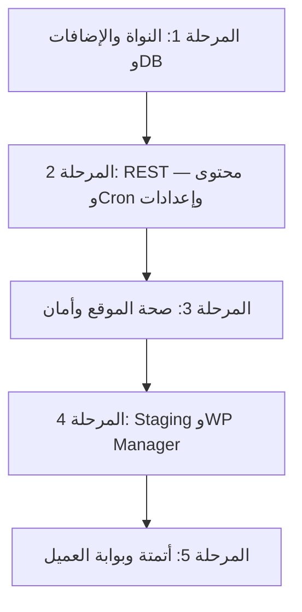

# CyberPanel WordPress — خطة التحكم الكامل

> **For agentic workers:** REQUIRED SUB-SKILL: Use `superpowers:subagent-driven-development` (recommended) or `superpowers:executing-plans` to implement this plan task-by-task. Steps use checkbox (`- [ ]`) syntax for tracking.

**Goal:** إكمال لوحة إدارة WordPress على CyberPanel في claudHosting لتصل لمستوى احترافي (cPanel / WP Toolkit) — بدون SSH — عبر CloudAPI وWordPress REST API وجلسة CyberPanel عند الحاجة.

**Architecture:** طبقة `CyberPanelApiService` للاتصال بـ CloudAPI وREST؛ `CyberPanelWordpressManagementService` لتسجيل الإجراءات و`refresh_info`؛ واجهة Blade بنفس نمط `cp-wp-*` الحالي (تبويبات pills + جداول تفاعلية). كل ميزة تُسجَّل في `config/cyberpanel_wordpress.php` وتُختبر بـ `Http::fake`.

**Tech Stack:** Laravel, CyberPanel CloudAPI (`/cloudAPI/`), WordPress REST API (`/wp-json/wp/v2/`), جلسة WP Manager (`/websiteFunctions/*` + CSRF), PHPUnit.

**قاعدة التنفيذ:** لا commit إلا بطلب صريح من المستخدم. لا تعديل ملفات `.cursor/plans/*.plan.md` القديمة.

---

## الوضع الحالي (مكتمل — لا تُعاد)

| المجال | الملفات الرئيسية |
|--------|------------------|
| إضافات/قوالب (عرض، تفعيل، تحديث، حذف) | `CyberPanelApiService`, `wp-plugins-themes-panel.blade.php` |
| مستخدمون (CRUD + كلمة مرور) | `getWpUsers`, `createWpUser`, `wp-users-panel.blade.php` |
| النواة (سياسات تحديث + إعادة تثبيت) | `reinstallWpCore`, `tab-core` في `management.blade.php` |
| صيانة (maintenance, debug, lscache, SEO index) | `updateWpSetting` |
| نسخ احتياطي Cloud | `createWpBackup`, `tab-backups.blade.php` |
| تشخيص + سجل عمليات | `diagnose`, `cp_wp_management_log` |
| إعدادات CyberPanel UI | `settings/index.blade.php` |

---

## خريطة المراحل

| المرحلة | الأولوية | المصدر التقني | تقدير |
|---------|----------|---------------|-------|
| 1 | عالية | CloudAPI + REST بسيط | 1–2 أسبوع |
| 2 | عالية | WordPress REST | 2 أسبوع |
| 3 | متوسطة | REST + metadata | 1–2 أسبوع |
| 4 | متوسطة | جلسة CyberPanel + WPid | 2–3 أسبوع |
| 5 | منخفضة | Jobs + notifications | 2+ أسبوع |

---

# المرحلة 1 — النواة، التثبيت، قاعدة البيانات، الكاش

## Task 1.1: تحديث النواة (Core Update)

**الملفات:**
- Modify: `app/Services/CyberPanel/CyberPanelApiService.php`
- Modify: `config/cyberpanel_wordpress.php`
- Modify: `app/Services/CyberPanel/CyberPanelWordpressManagementService.php`
- Modify: `resources/views/admin/cyberpanel/wordpress-sites/partials/management.blade.php` (تبويب النواة)
- Modify: `resources/views/admin/cyberpanel/wordpress-sites/partials/management-scripts.blade.php`
- Test: `tests/Unit/CyberPanel/CyberPanelWordpressManagementServiceTest.php`

**المنطق:**
- `core_check_update` — عبر REST: `GET /wp-json/wp/v2/...` أو CloudAPI إن وُجد؛ بديل: جلسة REST + قراءة صفحة `update-core.php` أو `wp core check-update` عبر wrapper جديد `runWpCliViaRest` (انظر Task 1.6).
- `core_update` — REST: متابعة رابط التحديث من `update-core.php` (نفس أسلوب `reinstallWpCoreViaWordPressDashboard`).
- `core_update_db` — REST POST أو جلسة `update-core.php?action=upgrade-db`.

- [ ] إضافة `checkWpCoreUpdate(string $domain): array` يُرجع `{ current, updates[] }`
- [ ] إضافة `updateWpCore(string $domain): array` مع fallback WP Manager (`installwpcore` / dashboard)
- [ ] إضافة `updateWpCoreDatabase(string $domain): array`
- [ ] تسجيل الإجراءات في `config/cyberpanel_wordpress.php`: `core_check_update`, `core_update`, `core_update_db`
- [ ] UI: بطاقة في `wpTabCore` تعرض الإصدار الحالي + زر «فحص التحديثات» + «تحديث النواة» + «تحديث قاعدة البيانات»
- [ ] اختبار `Http::fake` لمسار dashboard update

**معايير القبول:** من صفحة `s1.*` يظهر إصدار النواة؛ فحص التحديثات يعمل؛ التحديث يُكمل دون حذف `wp-content`.

---

## Task 1.2: تثبيت إضافات وقوالب من المستودع

**الملفات:**
- Modify: `CyberPanelApiService.php` — `installWpPlugin`, `installWpTheme`
- Modify: `wp-plugins-themes-panel.blade.php` — حقل بحث + زر «تثبيت»
- Modify: `management-scripts.blade.php`

**المنطق:**
- CyberPanel CloudAPI لا يوفّر `InstallPlugins` مباشرة في كل الإصدارات؛ استخدم **WordPress REST**:
  - Plugins: لا يوجد install رسمي في REST v2 — استخدم **جلسة REST + `POST` إلى `plugin-install.php`** أو CloudAPI `UpdatePlugins` بعد `wp plugin install` عبر wrapper.
- **الحل الموحّد للمرحلة 1:** إضافة `runWpCliCommand(string $domain, string $command): array` داخل `CyberPanelApiService` يُنفّذ عبر CyberPanel CloudAPI pattern (نسخ من `GetCurrentPlugins`: `ProcessUtilities` على السيرفر) — إن تعذّر، استخدم REST plugin directory search ثم تفعيل.

- [ ] `searchWpPlugins(string $domain, string $query): array` — REST `https://api.wordpress.org/plugins/info/1.2/` (خارجي) أو slug مباشر
- [ ] `installWpPlugin(string $domain, string $slug): array` — CloudAPI: إضافة controller مخصص **غير موجود** → نفّذ عبر `wordpressRestSession` + طلب admin `update.php?action=install-plugin`
- [ ] `installWpTheme(string $domain, string $slug): array` — نفس الأسلوب
- [ ] UI: صف «تثبيت إضافة» و«تثبيت قالب» بجانب أزرار التحديث
- [ ] اختبار unit لتثبيت إضافة وهمية

**معايير القبول:** تثبيت `akismet` أو `hello-dolly` من اللوحة؛ تظهر في القائمة بعد `refresh_info`.

---

## Task 1.3: معلومات قاعدة البيانات + phpMyAdmin

**الملفات:**
- Modify: `CyberPanelApiService.php` — `getWpDatabaseInfo`
- Modify: `CyberPanelSettingsService.php` — `buildPhpMyAdminLink($domain)` إن لم يكن موجوداً
- Create: `resources/views/admin/cyberpanel/wordpress-sites/partials/wp-database-panel.blade.php`
- Modify: `management.blade.php` — استبدال محتوى `wpTabDatabase`

**المنطق:**
- CyberPanel `websiteFunctions/fetchDatabase` (جلسة) أو CloudAPI إن وُجد.
- عرض: اسم DB، المستخدم، البادئة، حجم تقريبي.
- زر «فتح phpMyAdmin» → deep link من CyberPanel.

- [ ] `establishWebsiteSession` + `POST /websiteFunctions/fetchDatabase` مع `WPid` أو `domain`
- [ ] بطاقة معلومات DB في التبويب
- [ ] أزرار: «نسخة احتياطية» (موجود)، «فتح phpMyAdmin»
- [ ] اختبار parse لاستجابة `fetchDatabase`

---

## Task 1.4: فحص وإصلاح قاعدة البيانات

**الملفات:**
- Modify: `CyberPanelApiService.php` — `checkWpDatabase`, `repairWpDatabase`
- Modify: `wp-database-panel.blade.php`

**المنطق:** عبر REST غير متاح مباشرة — استخدم `runWpCliCommand` مع `db check` و `db repair` (انظر Task 1.6) أو جلسة CyberPanel.

- [ ] إجراءان `db_check`, `db_repair` في config
- [ ] عرض ناتج CLI في `<pre>` داخل التبويب
- [ ] اختبار Http::fake

---

## Task 1.5: الكاش وإعادة الروابط

**الملفات:**
- Modify: `config/cyberpanel_wordpress.php`
- Modify: `management.blade.php` (تبويب الصيانة)
- Modify: `CyberPanelApiService.php`

**الإجراءات:**
- `cache_flush` — `wp cache flush` أو REST + LSCache purge إن كان مفعّلاً (`updateWpSetting` lscache purge موجود جزئياً)
- `rewrite_flush` — `wp rewrite flush`
- `transient_delete_all` — `wp transient delete --all`

- [ ] ثلاثة أزرار في `wpTabMaint`
- [ ] تسجيل في سجل العمليات
- [ ] اختبارات unit

---

## Task 1.6: Wrapper موحّد لأوامر WP-CLI عبر CyberPanel

**الملفات:**
- Create: `app/Services/CyberPanel/CyberPanelWpCliBridge.php` (اختياري — أو methods في `CyberPanelApiService`)
- Modify: `CyberPanelApiService.php`

**المنطق:** CyberPanel ينفّذ `wp ... --path=/home/{domain}/public_html` داخلياً. لا يوجد CloudAPI عام — **الخيارات:**
1. توسيع CloudAPI على السيرفر (خارج النطاق)
2. **محاكاة عبر REST** لكل أمر (محدود)
3. **جلسة `websiteFunctions`** + endpoints موجودة لكل عملية

**القرار للمشروع:** لكل أمر جديد، prefer **CloudAPI controller موجود** ثم **REST** ثم **dashboard session**. وثّق في `CyberPanelApiService` method `resolveWpInstallPath(string $domain): string` (من `fetchWebsites` + `WPDeployments`).

- [ ] `resolveWpInstallPath($domain)` مشترك لكل العمليات
- [ ] refactor `reinstallWpCore` و`getWpUsers` لاستخدام helpers مشتركة (`establishWordPressRestSession`)
- [ ] توثيق في تعليق أعلى الملف: مصفوفة أولوية المصادر

---

# المرحلة 2 — محتوى، Cron، إعدادات، مستخدمون متقدم

## Task 2.1: تحسين إدارة المستخدمين

**الملفات:**
- Modify: `CyberPanelApiService.php` — `updateWpUserEmail`, `updateWpUserDisplayName`
- Modify: `wp-users-panel.blade.php` — نموذج تعديل
- Modify: `management-scripts.blade.php`

- [ ] تعديل البريد واسم العرض عبر `POST /wp-json/wp/v2/users/{id}`
- [ ] اختيار `reassign_to` عند الحذف (dropdown مستخدمين)
- [ ] عرض Application Passwords (قراءة فقط أو إنشاء عبر REST `application-passwords` إن WP ≥ 5.6)

---

## Task 2.2: إدارة المحتوى (مقالات وصفحات)

**الملفات:**
- Create: `resources/views/admin/cyberpanel/wordpress-sites/partials/wp-content-panel.blade.php`
- Modify: `management.blade.php` — تبويب فرعي جديد `wpTabContent`
- Modify: `CyberPanelApiService.php` — `listWpPosts`, `createWpPost`, `deleteWpPost`

- [ ] `GET /wp-json/wp/v2/posts?per_page=20&status=any`
- [ ] `GET /wp-json/wp/v2/pages?...`
- [ ] إنشاء مسودة: `POST` مع `title`, `content`, `status=draft`
- [ ] حذف: `DELETE` مع `force=true`
- [ ] جدول مع فلتر (منشور / مسودة / صفحات)
- [ ] اختبارات REST mock

---

## Task 2.3: Cron

**الملفات:**
- Create: `wp-cron-panel.blade.php`
- Modify: `CyberPanelApiService.php` — `listWpCronEvents`, `runWpCronEvent`

- [ ] عرض المهام عبر REST plugin أو `runWpCliCommand('cron event list --format=json')`
- [ ] زر «تشغيل الآن» لمهمة محددة
- [ ] تحذير إذا `DISABLE_WP_CRON` مفعّل في config

---

## Task 2.4: إعدادات WordPress الشائعة

**الملفات:**
- Create: `wp-settings-panel.blade.php`
- Modify: `CyberPanelApiService.php`

**الحقول:**
- `siteurl`, `home`, `blogname`, `blogdescription`, `WPLANG`
- `blog_public` (فهرسة — مكرر مع search_index؛ اجمعهما في UI واحد)
- `DISALLOW_FILE_EDIT` (أمان)

- [ ] `getWpOption` / `updateWpOption` عبر REST `settings` endpoint أو `wp option`
- [ ] نموذج حفظ مع تحذير عند تغيير `siteurl`

---

## Task 2.5: بحث واستبدال في قاعدة البيانات

**الملفات:**
- Modify: `wp-database-panel.blade.php`
- Modify: `CyberPanelWordpressManagementService.php` — إجراء `search_replace`

- [ ] حقول: نص قديم، نص جديد، dry-run checkbox
- [ ] تنفيذ عبر `wp search-replace` (جلسة/CLI bridge)
- [ ] تأكيد مزدوج + `confirm_dangerous` في الواجهة
- [ ] عرض الناتج في `<pre>`

---

# المرحلة 3 — صحة الموقع وأمان

## Task 3.1: لوحة صحة الموقع (Site Health)

**الملفات:**
- Create: `resources/views/admin/cyberpanel/wordpress-sites/partials/wp-health-panel.blade.php`
- Modify: `CyberPanelWordpressManagementService.php` — `buildSiteHealth(CyberPanelWordpressSite $site): array`
- Modify: `tab-overview.blade.php` — بطاقات KPI

**المؤشرات:**
- إصدار WP / PHP (من `refresh_info` + website)
- عدد تحديثات الإضافات/القوالب/النواة
- SSL مفعّل (من `$site->ssl_enabled` أو فحص HTTPS)
- وضع الصيانة / التصحيح / فهرسة SEO
- عمر آخر نسخة احتياطية
- حجم تقريبي لقاعدة البيانات

- [ ] دالة `getSiteHealth` تُرجع `{ score, checks: [{ id, label, status, message }] }`
- [ ] UI: شريط تقدم + قائمة فحوصات بألوان (success/warning/danger)
- [ ] تحديث تلقائي عند `refresh_info`

---

## Task 3.2: تحسينات أمان

**الملفات:**
- Modify: `wp-settings-panel.blade.php` أو `wp-health-panel.blade.php`
- Modify: `CyberPanelApiService.php`

- [ ] تفعيل/تعطيل `DISALLOW_FILE_EDIT`
- [ ] فرض `FORCE_SSL_ADMIN` (اختياري — تحذير)
- [ ] قائمة إضافات غير محدّثة كـ «خطر أمني»
- [ ] رابط لفحص Imunify/AI Scanner في CyberPanel إن وُجد على السيرفر

---

## Task 3.3: سجل تدقيق محسّن

**الملفات:**
- Modify: `CyberPanelWordpressManagementService.php` — `appendManagementLog`
- Modify: `wpTabLog` في `management.blade.php`

- [ ] تخزين `user_name`, `ip`, `method` (cloudapi/rest/session), `duration_ms`
- [ ] فلتر السجل حسب الإجراء / النجاح / التاريخ
- [ ] تصدير CSV للسجل

---

# المرحلة 4 — Staging وWP Manager المتقدم

## Task 4.1: استقرار WPid وWP Manager

**الملفات:**
- Modify: `CyberPanelApiService.php` — `resolveWpSiteId`, `scanWordpressSitesInManager`

- [ ] تخزين `wp_manager_id` تلقائياً عند أول `refresh_info` ناجح
- [ ] زر «مزامنة WP Manager» في تبويب النظرة العامة
- [ ] رسالة إرشادية واضحة عند فشل WPid مع رابط WP Manager

---

## Task 4.2: Staging

**الملفات:**
- Create: `wp-staging-panel.blade.php`
- Modify: `CyberPanelApiService.php` — `createWpStaging`, `deployStagingToProduction`, `deleteWpStaging`

**المنطق:** CyberPanel CloudAPI `CreateStaging` + `DeploytoProduction` (جلسة `websiteFunctions`).

- [ ] نموذج: اسم staging + نطاق فرعي
- [ ] قائمة بيئات staging الحالية
- [ ] أزرار: إنشاء، نشر للإنتاج، حذف
- [ ] اختبارات mock للجلسة

---

## Task 4.3: فحص سلامة الملفات

- [ ] إجراء `dataintegrity` عبر جلسة CyberPanel (`websiteFunctions/dataintegrity`)
- [ ] عرض الناتج في تبويب الصيانة

---

# المرحلة 5 — أتمتة وبوابة العميل

## Task 5.1: جدولة مهام

**الملفات:**
- Create: `app/Jobs/CyberPanelWpScheduledTaskJob.php`
- Create: migration `cyberpanel_wp_scheduled_tasks`
- Modify: `app/Console/Kernel.php`

**المهام المجدولة:**
- فحص تحديثات أسبوعي
- نسخ احتياطي يومي (اختياري)
- `refresh_info` لكل المواقع النشطة

- [ ] CRUD مهام من لوحة الإعدادات أو صفحة الموقع
- [ ] إشعار بريد عند فشل المهمة

---

## Task 5.2: إشعارات

- [ ] تكامل مع نظام إشعارات Laravel الموجود (إن وُجد) أو `Mail`
- [ ] قوالب: تحديثات متاحة، فشل نسخ احتياطي، فشل SSL

---

## Task 5.3: بوابة العميل

**الملفات:**
- Modify: `app/Http/Controllers/Client/...`
- Modify: `resources/views/client/...`

- [ ] عرض مواقع WordPress CyberPanel للعميل (قراءة + دخول WP فقط)
- [ ] إخفاء إجراءات خطرة (حذف، search-replace، staging deploy)
- [ ] ربط تجديد الاشتراك من `CyberPanelSubscriptionBillingService`

---

# تحسينات UI عبر كل المراحل

## Task UI.1: توحيد التجربة

- [ ] كل تبويب فرعي يتبع نفس نمط: `alert` توضيحي + أزرار علوية + `wp-pt-table-wrap`
- [ ] `showAlert` موحّد مع toast بدلاً من reload
- [ ] حفظ التبويب الفرعي النشط في URL: `?tab=wordpress&wp=users`
- [ ] تحديث نص `tab-cyberpanel-tools.blade.php` — إزالة «المستخدمين من WP Manager فقط»

## Task UI.2: حالة التحميل

- [ ] spinner على الصف أثناء إجراء الصف (مثل `wp-pt-row-busy`)
- [ ] تعطيل الأزرار أثناء `runAction`
- [ ] شريط تقدم لعمليات النسخ الاحتياطي (موجود جزئياً — تعميمه)

---

# الاختبارات والتحقق

## Task TEST.1: تغطية API

**الملف:** `tests/Unit/CyberPanel/CyberPanelApiServiceTest.php`

- [ ] test لكل method جديد في المرحلة 1–2 (Http::fake)
- [ ] test fallback paths (REST عند فشل CloudAPI)

## Task TEST.2: تغطية Management

**الملف:** `tests/Unit/CyberPanel/CyberPanelWordpressManagementServiceTest.php`

- [ ] test `executeAction` لكل إجراء جديد
- [ ] test `getSiteHealth` structure

## Task TEST.3: تحقق يدوي

**الموقع المرجعي:** `s1.claudsoft.com`

| الخطوة | الإجراء |
|--------|---------|
| 1 | `refresh_info` — إضافات + مستخدمون |
| 2 | تثبيت إضافة تجريبية |
| 3 | فحص تحديث النواة |
| 4 | نسخة احتياطية + استعادة على staging |
| 5 | Site Health يعرض SSL وPHP |

---

# ترتيب التنفيذ الموصى به (Sprint)

| Sprint | المهام | مخرجات |
|--------|--------|--------|
| **S1** | 1.6, 1.1, 1.5 | نواة + كاش + helpers |
| **S2** | 1.2, 1.3, 1.4 | تثبيت + DB |
| **S3** | 2.1, 2.4, UI.1 | مستخدمون + إعدادات + UI |
| **S4** | 2.2, 2.3, 2.5 | محتوى + cron + search-replace |
| **S5** | 3.1, 3.2, 3.3 | صحة + أمان + سجل |
| **S6** | 4.1, 4.2, 4.3 | Staging |
| **S7** | 5.x | أتمتة + عميل (حسب الحاجة) |

---

# مراجع الكود

| الغرض | المسار |
|-------|--------|
| سجل الإجراءات | `config/cyberpanel_wordpress.php` |
| API CyberPanel | `app/Services/CyberPanel/CyberPanelApiService.php` |
| منطق الإدارة | `app/Services/CyberPanel/CyberPanelWordpressManagementService.php` |
| واجهة الإدارة | `resources/views/admin/cyberpanel/wordpress-sites/partials/management.blade.php` |
| JS الإجراءات | `.../management-scripts.blade.php` |
| مرجع Coolify (WP-CLI كامل) | `config/wordpress_cli.php`, `app/Services/Coolify/WordpressManagementService.php` |
| CyberPanel cloudManager | `usmannasir/cyberpanel` → `GetCurrentPlugins`, `CreateStaging`, `UpdateWPSettings` |

---

# Execution Handoff

**Plan complete and saved to `docs/superpowers/plans/2026-05-31-cyberpanel-wordpress-full-management.md`.**

**خيارات التنفيذ:**

1. **Subagent-Driven (موصى به)** — مهمة فرعية لكل Task مع مراجعة بين المهام
2. **Inline Execution** — تنفيذ Sprint S1 في هذه الجلسة (`executing-plans`)

**للبدء:** قل «نفّذ Sprint S1» أو «ابدأ Task 1.1».
